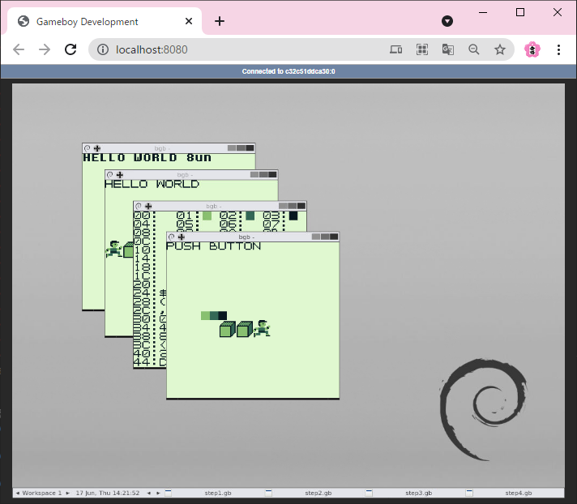

# ゲームボーイで動くゲームを作ろう - 日経ソフトウエア 2021/07号

日経ソフトウエア 2021/07号  
特集５  
ゲームボーイで動くゲームを作ろう  

第１部　開発環境を導入して実験プログラムを動かす  
松原　拓也（有限会社ニコ）　ゲームとロボットが好きな技術者兼ライター。家には古いゲーム機がたくさん転がっている。　「ゲームボーイ」は任天堂が1989年に発売した携帯型ゲーム機です。(64〜77ページ掲載記事から抜粋)    
*テキスト版記事の文字数：11955文字

**▼ 本記事はPDFで購入できます。**  
https://bizboard.nikkeibp.co.jp/kijiken/summary/20210524/NSW0276H_5021392a.html

**▼バックナンバー 日経ソフトウエア 2021/07号**  
https://info.nikkeibp.co.jp/media/NSW/atcl/mag/051400036/


# 始め方

本記事の内容を試すために、Dockerイメージを簡単に作成できるようにしました。VSCodeでサンプルプログラムを入力し、実際にそのプログラムをエミュレーターで実行することができます。



## 事前準備

次のツールをインストールします。

1. [git](https://git-scm.com/)
1. [VSCode](https://code.visualstudio.com/download)
1. [Docker](https://www.docker.com/)

## 開発環境の作成と起動

本リポジトリを開発用パソコンにクローンし、VSCodeで開きます。

```コマンドプロンプト.cmd
mkdir c:\workgit
cd c:\workgit
git clone https://github.com/ojyuken/nikkeibp202107-gb.git
code nikkeibp202107-gb
```

次の手順でVSCodeを操作し、Dockerイメージを作成し、開発環境を起動します。

1. "Remote - Containers" 拡張機能をインストールします。
1. 右下の角に追加された "Remote - Containers" 拡張機能のアイコンをクリックします。
1. リストが表示されますので、 "Remote-Containers: Reopen in Container" をクリックします。
1. Dockerのイメージが作成され、Dockerコンテナーが起動し、VSCodeからリモート操作できます。

※ VSCodeを再度起動した場合、"Remote-Containers: Reopen in Container"を再度選択してください。

## GBDK-2020

GBDK-2020は、`/opt/gbdk`にインストールされています。GBDK-2020に付属のサンプルプログラムは、次のコマンドでビルドすることができます。

```
cd /opt/gbdk/examples/gb
make
cd galaxy
wine /opt/bgb/bgb.exe galaxy.gb &
```

最後のコマンド(`wine /opt/bgb/bgb.exe galaxy.gb &`)で、エミュレーターを起動していますので、ブラウザーで次のURLにアクセスするとエミュレーターで`galaxy.gb`が実行されている様子を確認できます。    
http://localhost:8080/

## サンプルプログラム

雑誌に掲載されている記事の内容に沿って、STEP1からSTEP4までのフォルダーを用意しました。
雑誌のダウンロードページからソースコード等をダウンロードし、各フォルダ内のファイル(`main.c`)を開き、ソースコードを入力してください。

本開発環境は、Linux上に構築していますので、雑誌で説明されているWindows用のバッチファイルではビルドできません。その代わりに、`make`を使ってビルドできるように`Makefile`を各フォルダに用意しました。  
ソースコードを入力後、各フォルダ内で、`make`コマンドを実行してビルドを行ってください。

```
cd ~/workspace/tutorial/step1
make
```

**メモ：** 記事の中で、pythonを実行する場面がありますが、掲載されているソースコードは、Python 3で動作するようです。次のコマンドを使用してください。

```
cd ~/workspace/tutorial/step2/maketile
python3 maketile.py
```


### 自動化（ダウンロードからビルドまで）

次のコマンドを実行すると、ソースコードのダウンロードから、ソースコードの入力、ビルドを行うことができます。すぐに動作確認したい場合にご活用ください。

```
cd ~/workspace/
./prepare.sh
cd tutorial
make
```

> **実行時エラー:**  
> 次のような実行時エラーが発生した場合、`prepare.sh`ファイルの改行コードを`CRLF`ではなく、`LF`に変更してください。  
> `prepare.sh`を開き、VSCodeの右下にある `CRLF` をクリックして、選択リストから`LF`を選んでください。
> 
> gbdev@xxxxxxxxxxx:~/workspace$ ./prepare.sh  
> bash: ./prepare.sh: /bin/bash^M: bad interpreter: No such file or directory  


## 動作確認（エミュレーター）

サンプルプログラムは、エミュレーターで実行することができます。プログラムのビルド（`make`）が成功すると各フォルダ内にgbファイルが生成されますので、これをエミュレーターで動作確認することができます。

1. ブラウザーで http://localhost:8080/ にアクセスし、 `noVNC`にアクセスします。
1. ブラウザー内のデスクトップで右クリックし、メニューから "Gameboy Emulator - BGB" を選択します。
1. bgb が起動したら、画面内で右クリックし、メニューから "Load ROM" を選択します。
1. step1からstep4の各フォルダの中から、gb形式ファイルを選択し、エミューレーターで動作確認します。


# 特記事項

著作権上、雑誌に掲載されているソースコード等は、本リポジトリに含んでいません。サンプルプログラムを実行する際は、記事を入手し、雑誌のダウンロードページからソースコード等をダウンロードして、ソースコードを入力してください。  
尚、入力もしくは入手した雑誌のソースコード等は、著作権法により保護されています。
著作者および日経BPの許諾を得ずに、プログラムおよびデータそのものまたは改変したものを配布したり販売したりすることはできません。
